# 🧰 Daily Pascal Modules

A curated collection of production-ready, lightweight, and zero-overhead Object Pascal micro-modules for everyday development.

Instead of pulling in heavy, monolithic libraries or complex visual frameworks (like VCL or LCL) for basic tasks, you can simply copy a single unit or a folder from this repository and drop it straight into your project.

---

## 🎯 The Philosophy

* **Zero Boilerplate:** No heavy configurations, no complex setups, no external third-party DLLs. Just pure Pascal code.
* **Plug & Play:** Units are completely isolated and self-contained. Copy-paste the source file and add it to your project's `uses` clause.
* **Maximum Compatibility:** Designed to be highly portable. Fully compatible with legacy and modern compilers alike, including **Delphi 4 and higher** as well as **Free Pascal Compiler (FPC) 2.0.0 and higher**.
* **Bite-Sized:** Each unit solves exactly *one* specific domain problem beautifully, minimally, and efficiently.

---

## 📁 Repository Structure

The modules are isolated inside the `Modules` directory, accompanied by minimal test drivers:

```text
.
├── Modules/                  # All production-ready micro-modules
│   ├── BmpLoader.pas
│   ├── PixelCopier.pas
│   ├── PixelPainter.pas
│   ├── Support.pas
│   ├── TgaLoader.pas
│   ├── WinLiteEnums.pas
│   ├── WinLiteEvents.pas
│   ├── WinLiteKeyMapper.pas
│   ├── WinLiteMainWindowWin9x.pas
│   ├── WinLiteQueue.pas
│   ├── WinLiteSoftwareWindow.pas
│   └── WinLiteSoftwareWindowWin9x.pas
└── Samples/                  # Verification samples (Plasma, Starfield, etc.)
    └── WinLitePlasmaDemo.pas
```

---

## 🗂️ Detailed Module Overview

Here is the complete breakdown of the available units, organized by their respective domain:

### 🖼️ Core Graphics & Blitting

* **`PixelPainter.pas`**
  The heart of the software rasterization engine. Provides procedural canvas primitives to draw individual pixels, geometric lines, shape fills, custom math loops, and custom drawing routines directly onto a memory buffer on the CPU.
* **`PixelCopier.pas`**
  A high-speed blitting and memory copy tool. Efficiently transfers raw arrays of texturing elements or parts of memory blocks onto the main window frame buffer with zero overhead.
* **`Support.pas`**
  A minimal collection of low-level helper definitions, core mathematical constants, type structures, and color generation utilities (`MakeColor`) shared across graphics operations.
  * **`OpenGLConsts.pas`**
  A centralized, exhaustive registry of all system constants, flags, and tokens ever introduced into the OpenGL specification from v1.0 up to v4.6 (including major ARB/EXT extensions).
* **`OpenGLFuncs.pas`**
  Declares procedural types and raw pointers for OpenGL functions across all eras. Written with strict platform calling conventions (`stdcall` / `cdecl`) for perfect x86 and x64 cross-compiler compatibility.
* **`OpenGLLoader.pas`**
  The core runtime binder of the hardware pipeline. It dynamically binds pointers to OS-specific driver libraries (`opengl32.dll` / `libGL.so`). Features a safe `Loader.Init(Major, Minor)` context initializer.
* **`OpenGLTypes.pas`**
  A lightweight utility module declaring primitive data types perfectly matching the official Khronos specification (`GLint`, `GLfloat`, etc.), eliminating type-shadowing conflicts with native Pascal types.

### 📥 Asset Loading (Zero External Dependencies)

* **`BmpLoader.pas`**
  A standalone, pure Pascal bitmap image decoder designed to parse standard uncompressed 24-bit and 32-bit BMP files directly into simple record-based pixel arrays via basic file streams.
* **`TgaLoader.pas`**
  A zero-dependency Truevision TGA image asset loader. Supports parsing both raw uncompressed and RLE-compressed 24-bit and 32-bit TGA image files.

### 🪟 WinLite Windowing System & Event Architecture

* **`WinLiteSoftwareWindow.pas`**
  The unified, multi-compiler interface unit acting as the primary entry point for lightweight window lifecycle management, canvas surface binding, and screen presentation (`Present`).
* **`WinLiteSoftwareWindowWin9x.pas`** & **`WinLiteMainWindowWin9x.pas`**
  The actual hardware-level backend implementation optimized for legacy and retro Windows platforms. Encapsulates raw Win32 system APIs (`CreateWindowEx`, GDI device contexts, and basic bitmap delivery handles) to run flawlessly even on legacy environments without modern OS footprints.
* **`WinLiteEvents.pas`**
  Defines the universal, lightweight event data structures used to cleanly process hardware inputs, window loop breaks (`Quit`), mouse movement updates, and key updates.
* **`WinLiteQueue.pas`**
  A robust, fixed-size ring-buffer event queue designed to buffer system messages and ensure clean asynchronous event polling within the application loop without continuous memory allocations.
* **`WinLiteKeyMapper.pas`**
  Maps raw platform-dependent OS scan codes and virtual key codes into cross-compiler, clean internal enumeration tokens.
* **`WinLiteEnums.pas`**
  Centralized lookup enumerations declaring primitive states, interface tokens, hardware loop flags, and state flags (`Pressed`, `Released`).

---

## 🚀 Quick Integration Guide

To use these modules (e.g., creating a simple application loop with `PixelPainter` and `WinLiteSoftwareWindow`) in your codebase:

1. **Copy** the required `.pas` files from the `Modules` folder into your project folder.
2. Include them directly in your program's `uses` section:

```pascal
program YourApplication;

{\$IFDEF FPC}
  {\$mode objfpc}{\$H+}
{\$ELSE}
  {\$LONGSTRINGS ON}
{\$ENDIF}

uses
  SysUtils,
  WinLiteEnums,
  WinLiteEvents,
  WinLiteSoftwareWindow,
  PixelPainter;

const
  WinWidth  = 800;
  WinHeight = 600;

var
  Window      : TSoftwareWindow;
  Event       : TEvent;
  PixelBuffer : TBytes;
  Render      : TPixelPainter;
  Error       : string;
begin
  if not Window.CreateWindow(WinWidth, WinHeight, 'Everyday Pascal Demo', Error) then
    Halt(1);

  SetLength(PixelBuffer, WinWidth * WinHeight * 4);
  Render.Init(WinWidth, WinHeight, 4, PixelBuffer);

  while Window.IsRunning do
  begin
    while Window.GetEvent(Event) do
    begin
      if Event.FType = Quit then Window.StopEvent;
    end;

    Render.SetColor(MakeColor(255, 64, 64));
    Render.Clear;

    Window.Present(PixelBuffer, WinWidth, WinHeight);
  end;

  Window.Done;
end.
```

---

## 🛠️ Building & Compiling

Since these modules rely on standard Pascal syntax features, they can be compiled instantly using your favorite IDE (Lazarus, Delphi) or command-line compilers without any third-party build tools.

**Using Free Pascal Compiler (FPC):**
```bash
fpc -B -O2 YourProgram.pas
```

**Using Delphi Command Line Compiler (DCC32):**
```bash
dcc32 YourProgram.pas
```

---

## 🤝 Contributing

Do you have a tiny, reliable Object Pascal utility unit that you copy into every new project you start? Feel free to open a Pull Request! Please ensure your unit is self-contained, keeps strict backwards compatibility (Delphi 4+ / FPC 2+), and includes a short sample program for testing.

## 📄 License
This project is open-source software licensed under the **Boost Software License - Version 1.0**. Feel free to use these modules in personal, educational, commercial projects, or legacy software retro-maintenance.

---

## 🖼️ Demos Showcase

Here is the full breakdown of the software rendering examples running live on the CPU. Micro-modules calculate every single pixel inside a native frame buffer memory block with zero external GPU hardware acceleration.

<p align="center">
  <!-- Row 1: Water Ripple & CPU Fire -->
  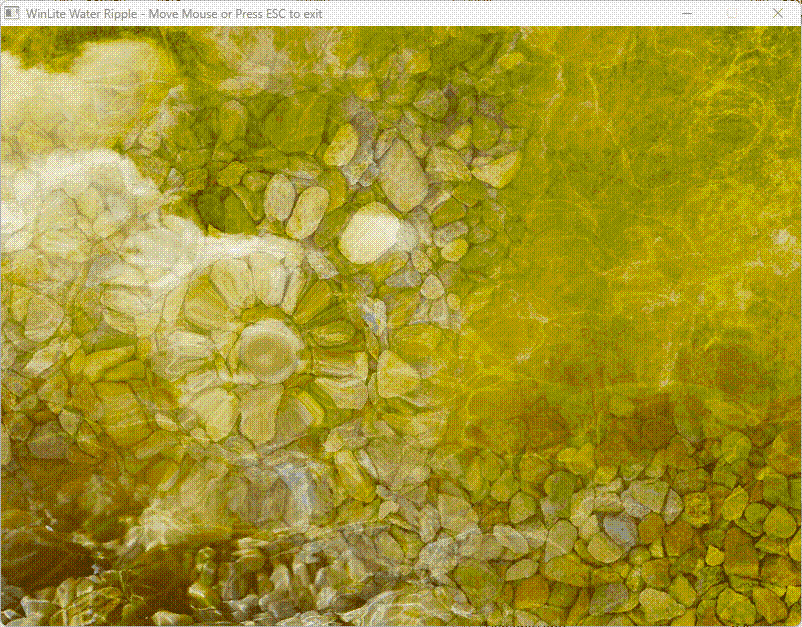
  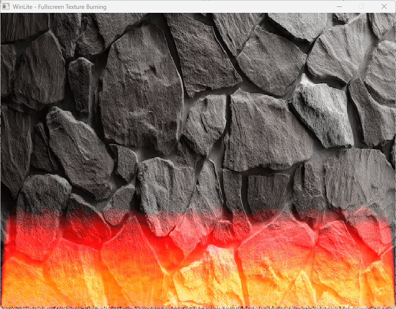
</p>
<p align="center">
  <em>Left: Water Ripple Screen Distortion (Sample 1). Right: Texture Burning Fire Engine (Sample 5).</em>
</p>

<br/>

<p align="center">
  <!-- Row 2: Dynamic Light & CPU Mosaic -->
  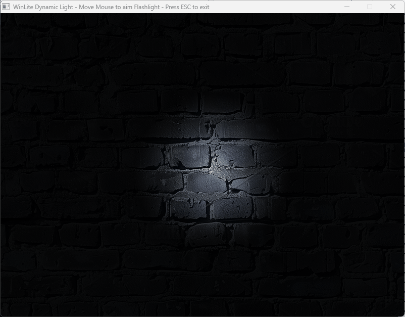
  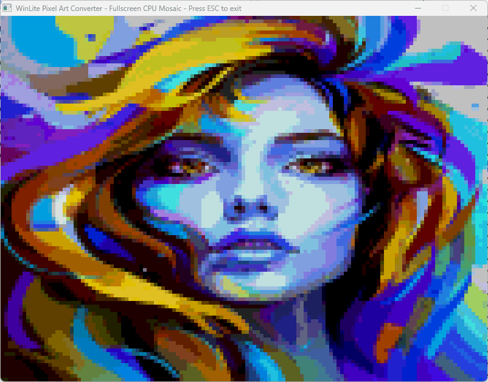
</p>
<p align="center">
  <em>Left: Dynamic Fog & Raycasting Flashlight (Sample 6). Right: Interactive Pixel Art Converter (Sample 4).</em>
</p>

<br/>

<p align="center">
  <!-- Row 3: Ghosting Trails & CRT Glitch -->
  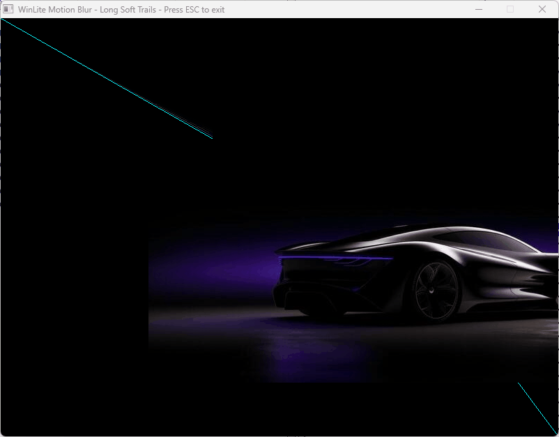
  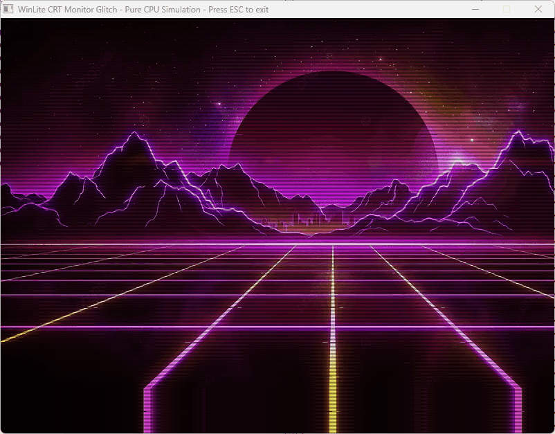
</p>
<p align="center">
  <em>Left: Motion Blur & Ghosting Trails (Sample 8). Right: Retro CRT Scanline & Line Jitter Glitch (Sample 3).</em>
</p>

<br/>

<p align="center">
  <!-- Row 4: Retro Plasma & Mandelbrot Fractal -->
  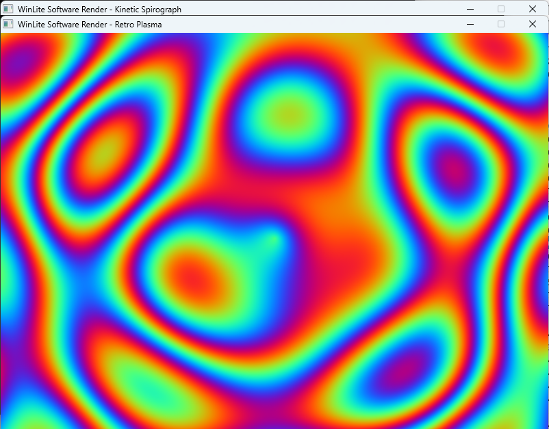
  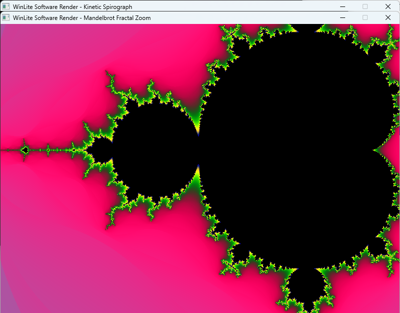
</p>
<p align="center">
  <em>Left: Classic Retro Software Plasma. Right: Mandelbrot Fractal Zoom Loop.</em>
</p>

<br/>

<p align="center">
  <!-- Row 5: Moire Pattern & Digital Silk Fabric -->
  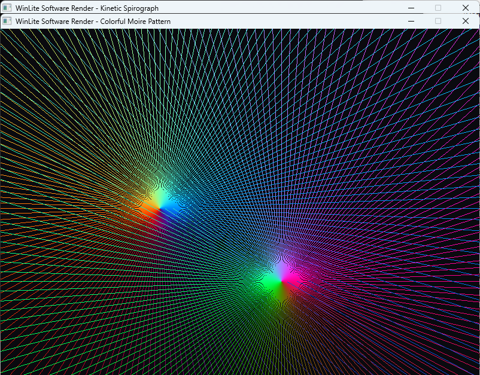
  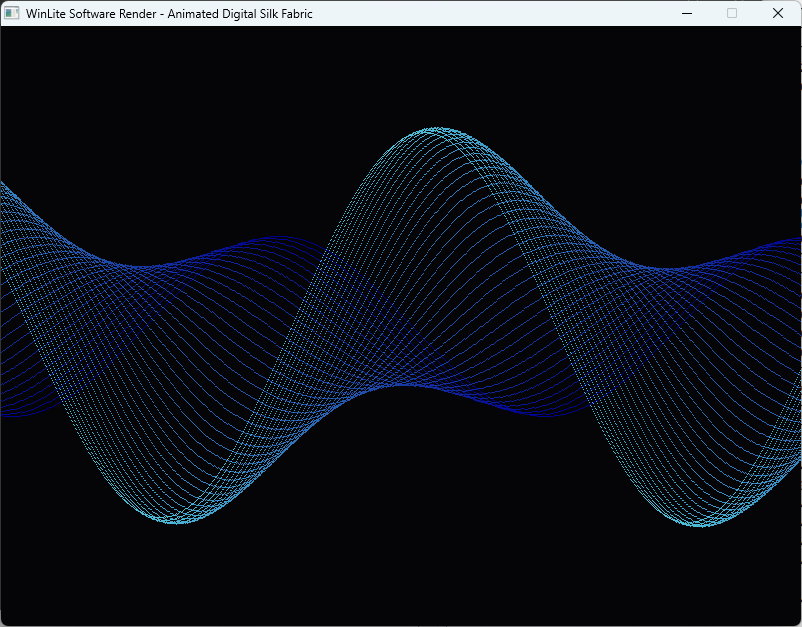
</p>
<p align="center">
  <em>Left: Colorful Moire Interference Lines. Right: Sine Wave Digital Silk Fabric.</em>
</p>

<br/>

<p align="center">
  <!-- Row 6: Fractal Canopy & Synthwave 3D Grid -->
  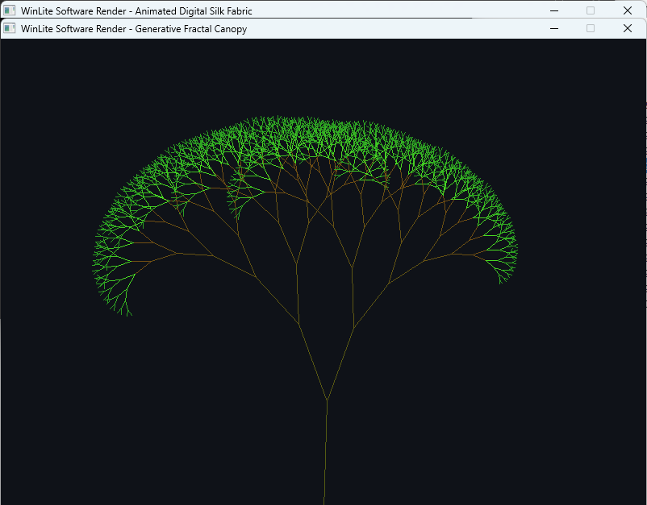
  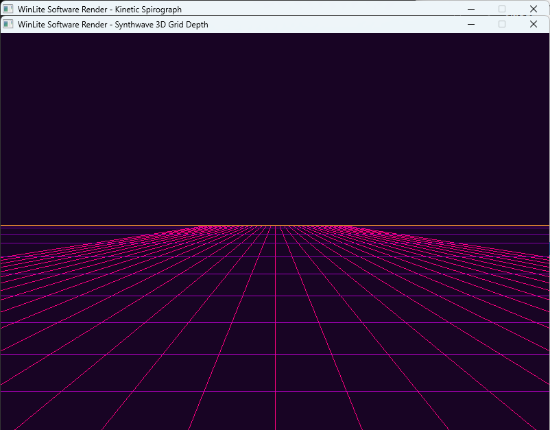
</p>
<p align="center">
  <em>Left: Fractal Canopy Pythagoras Tree. Right: Synthwave 3D Grid Depth Engine.</em>
</p>

<br/>

<p align="center">
  <!-- Row 7: Matrix Digital Rain & 3D Starfield Warp -->
  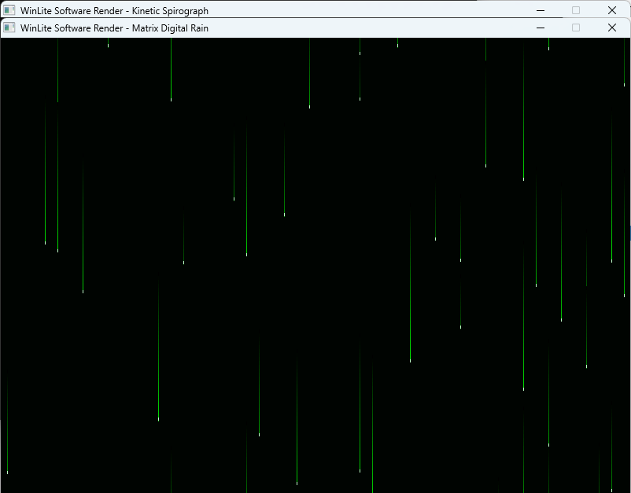
  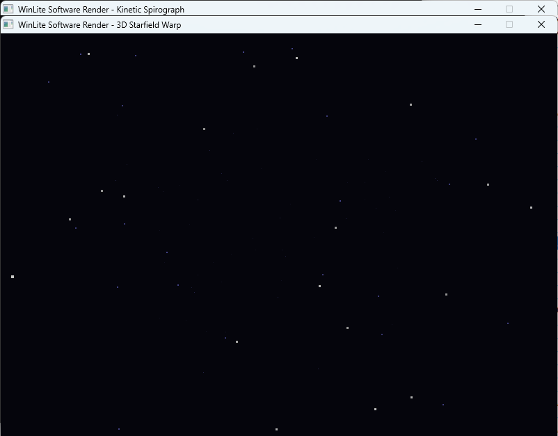
</p>
<p align="center">
  <em>Left: Matrix Digital Rain Streams. Right: 3D Starfield Warp Simulation.</em>
</p>

<br/>

<p align="center">
  <!-- Row 8: Cyber Tunnel & Kinetic Spirograph -->
  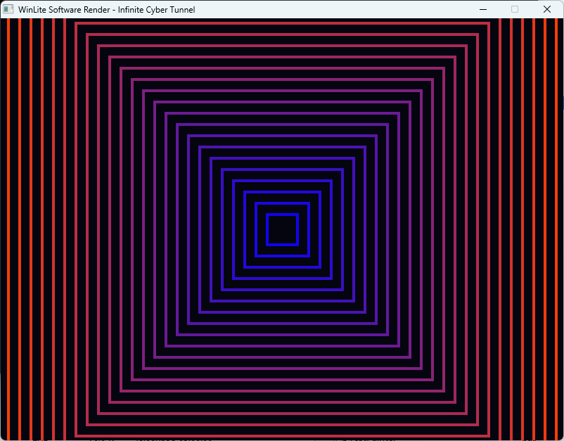
  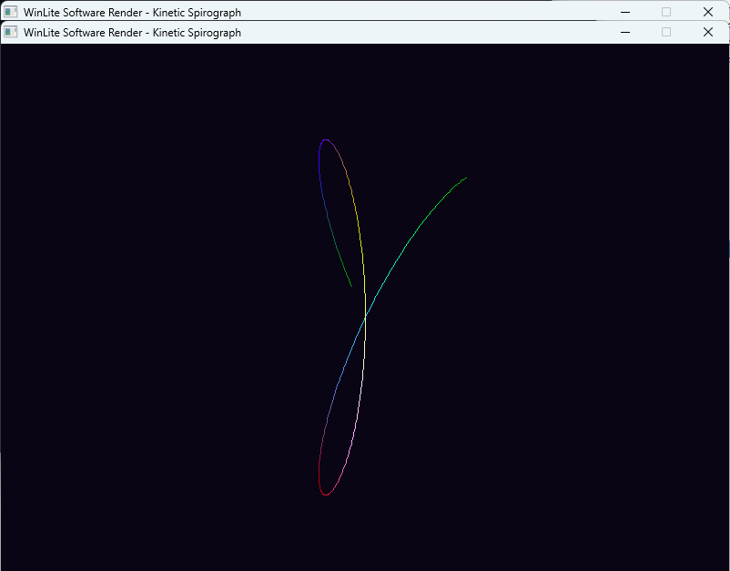
</p>
<p align="center">
  <em>Left: Infinite 3D Cyber Tunnel (Sample 9). Right: Kinetic Spirograph Lace Curves.</em>
</p>

---
